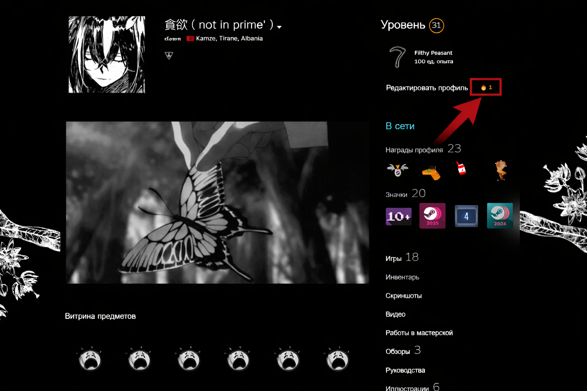
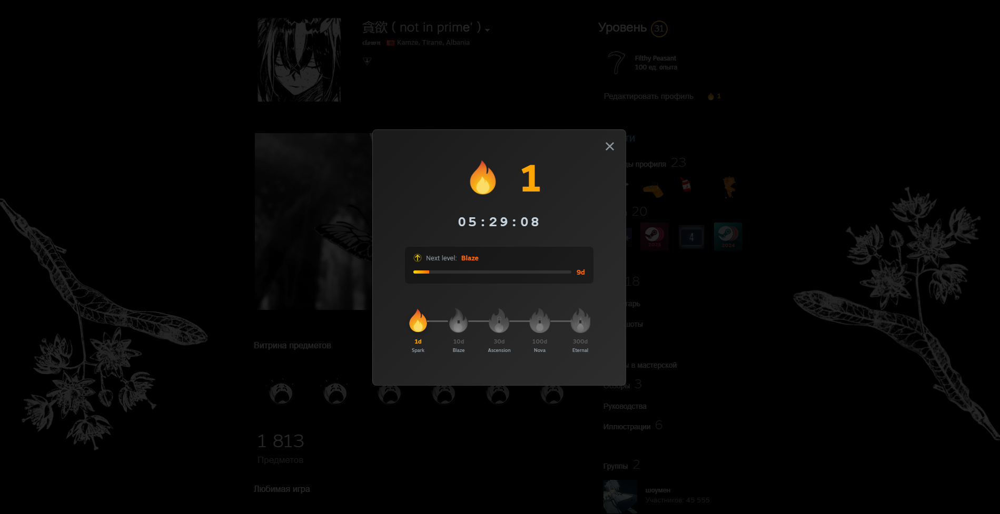
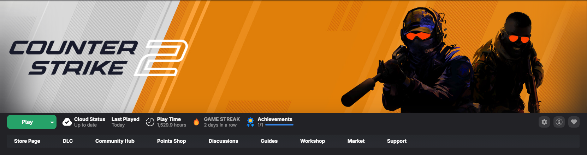

# Steam Streak 🔥
## This is a fork to add support for [SpaceThemes](https://github.com/SpaceTheme/Steam)
A [Millennium](https://steambrew.app/) plugin that tracks your daily Steam visits and game streaks with beautiful fire levels.

 

 

  
### 💡 Quick Tip

**Left-click** 🖱️ the fire icon to instantly claim your daily streak  
**Right-click** 🖱️ for detailed information, progress tracking, and countdown timer

 

---

## Features

- **Daily Streak Tracking** — Click the fire icon on your profile to claim your daily visit
- **Game Streak Widget** — Track consecutive days playing each game in your library
- **5 Fire Levels** — Progress through increasingly impressive fire icons
- **Progress Tracking** — See your progress to the next level with a dynamic gradient progress bar
- **Countdown Timer** — Know exactly when you can claim your next streak (24-hour countdown)
- **Persistent Data** — Your streaks are saved locally and persist across Steam restarts
- **Click-to-Claim** — Profile streak only increments when you actively click the fire icon

## Fire Levels

Progress through 5 unique fire levels as your streak grows:

| Level | Name | Days Required | Icon |
|:-----:|:----:|:-------------:|:----:|
| 1 | **Spark** | 1-9 days |  |
| 2 | **Blaze** | 10-29 days |  |
| 3 | **Ascension** | 30-99 days |  |
| 4 | **Nova** | 100-299 days |  |
| 5 | **Eternal Flame** | 300+ days |  |

## Installation

### Method 1: Millennium Plugin Installer (Recommended)

1. Open Steam with Millennium installed
2. Go to **Steam** → **Millennium** → **Plugins**
3. Click **Install a plugin**
4. Search for "Steam Streak" and click **Install**
5. Restart Steam when prompted

### Method 2: Manual Installation

1. Download the latest release from [Releases](https://github.com/BambooFury/steam-streak/releases)
2. Extract to your Steam plugins folder:
   - **Windows:** `C:\Program Files (x86)\Steam\plugins\steam-streak`
   - **Linux:** `~/.millennium/plugins/steam-streak`
3. Restart Steam
4. Enable the plugin in Millennium settings

## Usage

### Profile Streak

1. Visit your Steam profile
2. Look for the fire badge next to "Edit Profile"
3. **Left-click** the fire icon to quickly claim your daily streak
4. **Right-click** the fire icon to view detailed information:
   - Current streak and countdown timer
   - Progress to next fire level
   - All fire level milestones
5. Come back tomorrow to continue your streak!

**Note:** You must click the fire icon each day to maintain your streak. Simply launching Steam is not enough!

### Game Streak

1. Open your Steam library
2. Click on any game you've played recently
3. Look for the "GAME STREAK" widget in the game stats section (next to Cloud Status, Last Played, Play Time)
4. The widget shows how many consecutive days you've played that specific game
5. Game streaks are tracked automatically based on your play sessions

## License

This project is licensed under the MIT License - see the [LICENSE](LICENSE) file for details.

## Credits

Created for the [Millennium](https://steambrew.app/) Steam client modding platform.

Fire icons designed specifically for this plugin.
